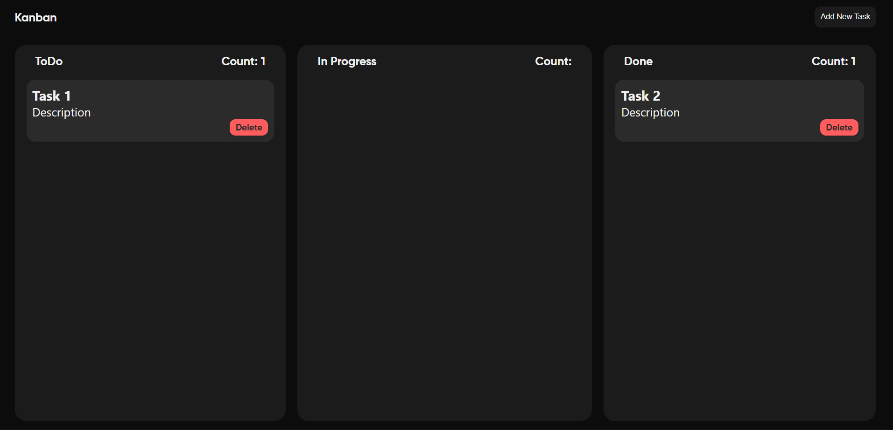
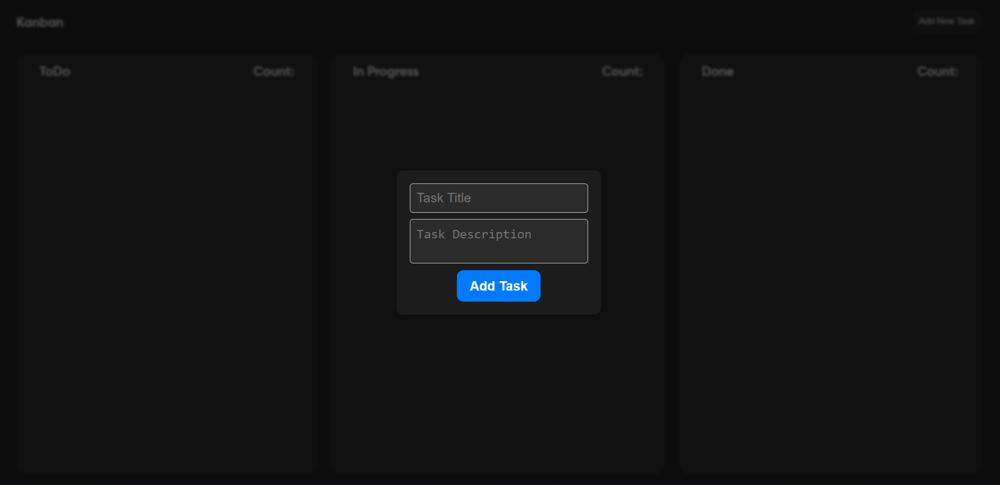
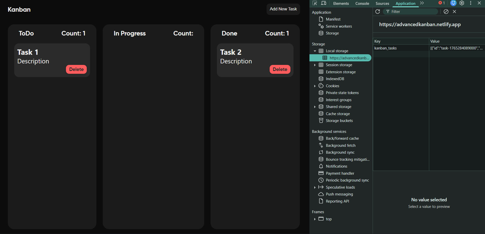

# Kanban Board

A simple, drag-and-drop Kanban board web app for managing tasks in "ToDo", "In Progress", and "Done" columns. Tasks can be added, deleted, and moved across columns, with persistent storage in the browser's localStorage.

## Features

- Add new tasks with title and description via a modal form.
- Drag and drop tasks between columns.
- Delete tasks with a delete button.
- Dynamic task count display per column.
- All tasks are saved in localStorage for persistence across browser sessions.
- Responsive and clean modern UI styled with CSS variables and custom font.

## Demo

 

## Installation

1. Clone or download the repository.
2. Open `index.html` in any modern web browser.

No server setup is needed since this is a pure front-end project.

## Usage

- Click **Add New Task** to open the modal.
- Enter task title and description, then click **Add Task**.
- Drag tasks between the columns to update their status.
- Click **Delete** on a task to remove it.
- Task counts update automatically for each column.
- Tasks are saved automatically and restored on page reload.

## File Structure

- `index.html` — HTML markup with main Kanban layout and modal.
- `style.css` — CSS styles including colors, layout, and animations.
- `script.js` — JavaScript handling task creation, drag/drop, deletion, and localStorage persistence.

## Technologies

- HTML5
- CSS3 (with CSS variables and custom fonts)
- Vanilla JavaScript (ES6+)
- Browser localStorage for saving tasks

## Future Improvements

- Add due dates and priority levels for tasks.
- Enable task editing after adding.
- Filter or search tasks.
- User authentication and cloud sync.
